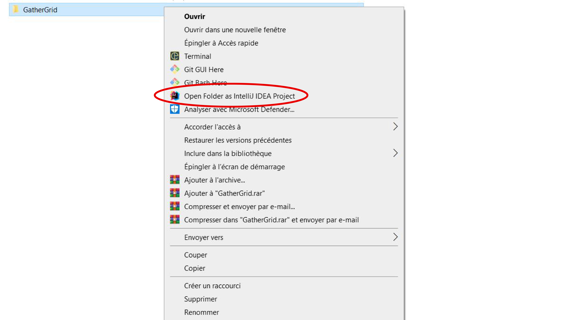

# Document d'Architecture JEE pour GatherGrid

## Introduction ✅

Le présent document vise à décrire l'architecture du projet GatherGrid, une plateforme de gestion d'événements basée sur les technologies Java Enterprise Edition (JEE). Il couvrira les choix technologiques, la structure du projet Maven, ainsi que les technologies principales utilisées, telles que Jakarta EE, Hibernate, JPA, Servlets, JSP et le serveur d'application Tomcat.

## Configuration de l'Environnement de Développement ⚠️

### Versions des Technologies Utilisées

Pour garantir la compatibilité et la cohérence du projet GatherGrid, assurez-vous d'utiliser les versions spécifiques des technologies suivantes :

| Technologies              | Version                   |
|:--------------------------|:--------------------------|
| [Java](#)                 | JDK 11.0.20               |
| [Maven](#)                | 4.0.0                     |
| [Apache Tomcat](#)        | 10.1.14                   |
| [Jakarta EE](#)           | JEE 11.0.20               |
| [Servlet](#)              | 5.0.0                     |
| [Hibernate](#)            | 6.2.7.Final               |
| [Java Persistence API](#) | Jakarta Persistence 3.1.0 |
| [MySQL](#)                | 8.0.33                    |
  
### Configuration de l'Environnement

Si vous souhaitez cloner et exécuter le projet GatherGrid sur votre propre environnement de développement, suivez ces étapes :

###### Étape 1 : Importation du Projet

- Clonez le référentiel du projet depuis GitHub en utilisant la commande Git suivante :

        git clone https://github.com/MehdiEz-z/GatherGrid.git

- Importez le projet dans votre environnement de développement (par exemple IntelliJ IDEA) en tant que projet Maven.

###### Étape 2 : Configuration de Tomcat

- Dans la barre d'outils en haut, cliquez sur `Current File (Fichier actuel)`.
- Dans le menu déroulant, sélectionnez `Edit Configurations (Modifier les configurations)`.

- Dans la fenêtre `Run/Debug Configurations (Configurations d'exécution/débogage)`, cliquez sur le bouton `+` pour ajouter une nouvelle configuration.
- Dans la barre de recherche, tapez `Tomcat` pour trouver la configuration `Local` de Tomcat.

- Une fois que vous avez sélectionné `Local`, vous obtiendrez une page de configuration de Tomcat avec des détails sur la version de Tomcat installée.
- Cliquez sur le bouton `Fix` en bas de cette page.
- Dans la fenêtre `Select an artifact to deploy`, vous pouvez choisir le fichier WAR de votre application web.
- Cliquez sur le bouton `Apply` puis `Ok` pour enregistrer la configuration.

###### Étape 3 : Lancement du Serveur

Une fois que la configuration Tomcat est correctement définie, vous pouvez lancer le serveur Tomcat en cliquant sur le bouton `Run (Exécuter)` en haut de votre environnement de développement.

Ces étapes vous permettront d'importer le projet et de configurer et de lancer Tomcat dans votre environnement de développement, prêt à exécuter votre application GatherGrid. Assurez-vous que les chemins des fichiers et les configurations de Tomcat correspondent à votre environnement spécifique.

Après avoir lancé le serveur Tomcat, l'application web GatherGrid s'ouvrira automatiquement dans votre navigateur par défaut.

